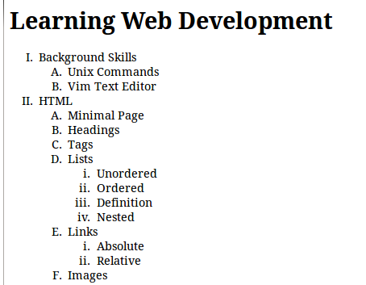
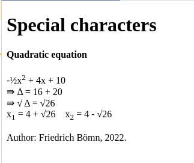
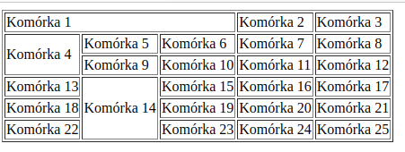
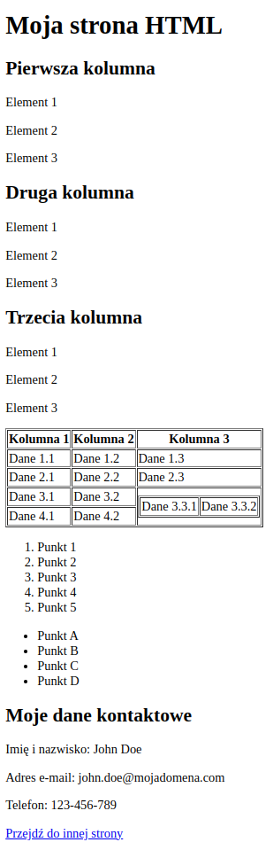
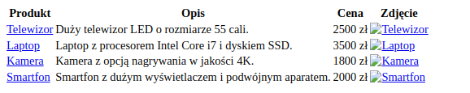

## Laboratorium 1 - Wprowadzenie do języka znaczników HTML

**Zadanie 1** (X pkt)

Wykorzystując język znaczników HTML, utwórz poniżej dokument, który będzie wyglądał następująco: 

**Zadanie 2** (X pkt)

Wykorzystując język znaczników HTML, utwórz poniżej dokument, który będzie wyglądał następująco:

Pozycjonowanie elementów (wyśrodkowanie górnego nagłówka) oraz rozmiar czcionki jest opcjonalny.

Treść dokumentu nie musi być jeden do jednego.

**Zadanie 3** (X pkt)

Wykorzystując język znaczników HTML, utwórz poniżej dokument, który będzie wyglądał następująco:

**Zadanie 4** (X pkt)

Wykorzystując język znaczników HTML, utwórz poniżej dokument, który będzie wyglądał następująco:

**Zadanie 5** (X pkt)

Wykorzystując język znaczników HTML, utwórz poniżej dokument, który będzie wyglądał następująco:

**Zadanie 6** (X pkt)

Wykorzystując język znaczników HTML, utwórz poniżej dokument, który będzie wyglądał następująco:

W kolumnie zdjęcia powinny się znaleźć naprawdę zdjęcia produktów, które są klikalne i przekierowują na stronę z produktem.
