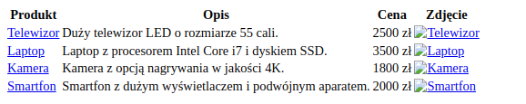
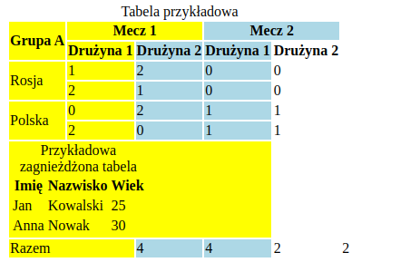
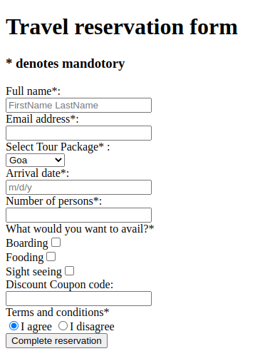
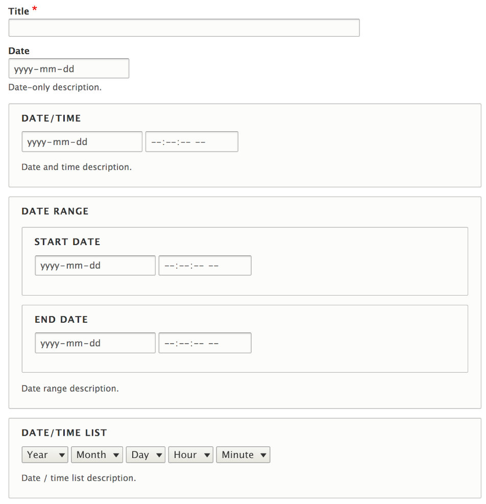
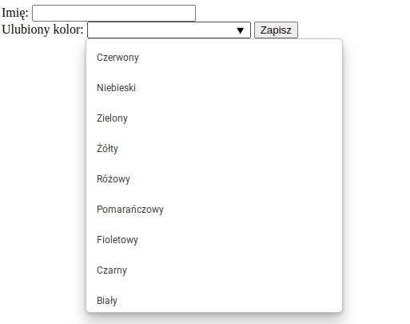
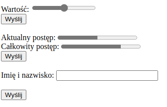
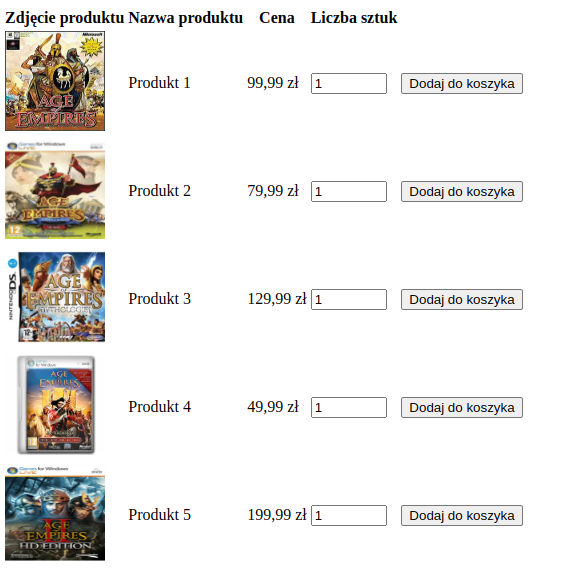

## Laboratorium 2 - Zaawansowane elementy języka HTML

**Zadanie 1** (X pkt)

Wykorzystując język znaczników HTML, utwórz poniżej dokument, który będzie wyglądał następująco: 

W kolumnie zdjęcia powinny się znaleźć naprawdę zdjęcia produktów, które są klikalne i przekierowują na stronę z produktem.

**Zadanie 2** (X pkt)

Wykorzystując język znaczników HTML, utwórz poniżej dokument, który będzie wyglądał następująco:

Wskazówka: Kolory zostały nadane poprzez pogrupowanie kolumn (znacznik colgroup).

**Zadanie 3** (X pkt)

Wykorzystując język znaczników HTML, utwórz poniżej dokument, który będzie wyglądał następująco:

**Zadanie 4** (X pkt)

Wykorzystując język znaczników HTML, utwórz poniżej dokument, który będzie wyglądał następująco:

Użyte style można tutaj pominąć. Natomiast należy zachować obramowania (znacznik fieldset).

**Zadanie 5** (X pkt)

Wykorzystując język znaczników HTML, utwórz poniżej dokument, który będzie wyglądał następująco:

Pierwszy formularz  powinien zawierać pole "Imię" oraz pole "Ulubiony kolor", które pozwala użytkownikowi wybrać swój ulubiony kolor z listy predefiniowanych kolorów. Użyj do tego pola typu datalist. Ostatni formularz ma zawierać ukryte pole o dowolnej wartości.

**Zadanie 6** (X pkt)

Wykorzystując język znaczników HTML, utwórz poniżej dokument, który będzie wyglądał następująco:

