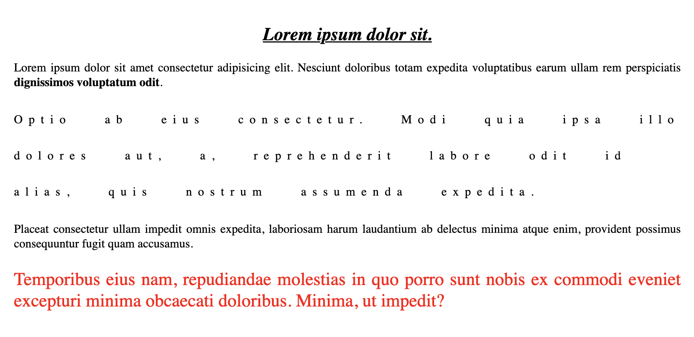
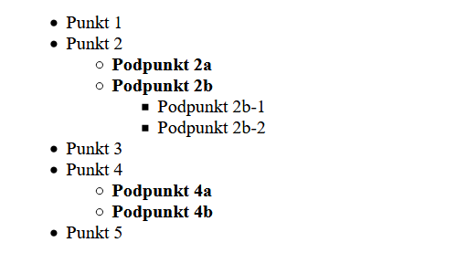
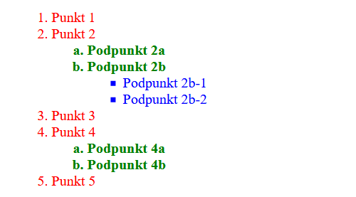
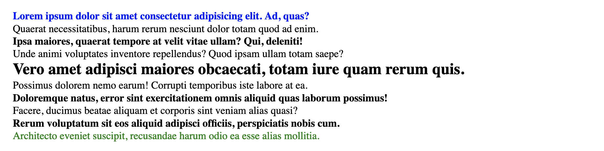
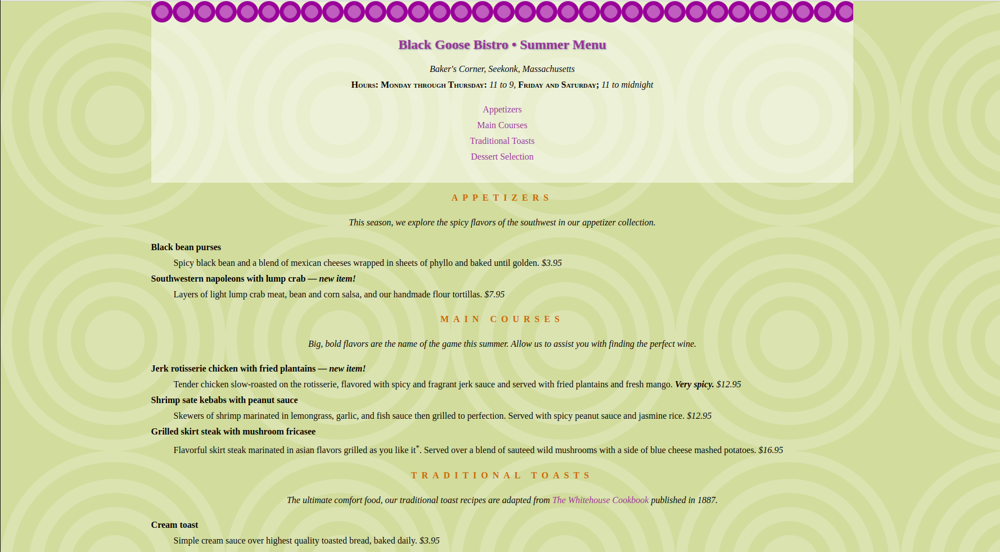

## Laboratorium 3 - Wprowadzenie do kaskadowych arkuszy stylów - CSS
**Zadanie 1** (X pkt)

Korzystając z języka znaczników HTML utwórz dokument, który będzie zawierał:

- Nagłówek h2 z zawartością widoczną na poniższym rysunku
- 4 akapity z tekstem Lorem ipsum o długości 20 słów każdy. P

Następnie korzystając z kaskadowych arkuszy stylów wykonaj następujące zadania:

- Tekst nagłówka powinien być zapisany kursywą, podkreślony i wycentrowany.
- Tekst we wszystkich akapitach powinien być wyjustowany.
- Dla trzech ostatnich słów akapitu pierwszego dodaj klasę strong i opisz ją tak, aby tekst w niej był pogrubiony.
- Dla drugiego akapitu dodaj klasę second i dodaj dowolny odstęp pomiędzy literami, słowami i liniami. Dodatkowo nadpisz styl z punktu drugiego, aby tekst był wyrównany do lewej.
- Dodaj dla ostatniego akapitu klasę last i odwołując się do niej opisz tekst tak, aby był wielkości 1.5em oraz był koloru czerwonego.
Sprawdź, jak prezentuje się strona, jeżeli zmniejszysz okno przeglądarki.

W efekcie rezultat powyższego kodu powinien przedstawiać się następująco:

[](assets/zad_01.png)


**Zadanie 2** (X pkt)

Korzystając z języka znaczników HTML utwórz dokument, który będzie zawierał dwie kopie przedstawionej niżej zagnieżdżoną listy nieuporządkowanej oraz uporządkowanej.

Następnie utwórz styl modyfikujący pierwszą listę tak, aby pierwszy poziom zagnieżdżenia był zapisany pogrubioną czcionką.
[](assets/zad_02a.png)

Następnie korzystając z odpowiednich właściwości na drugiej liście utwórz styl, aby w kontekście znacznika ul dał pokazany niżej efekt.

[](assets/zad_02b.png)

**Zadanie 3** (X pkt)

Korzystając z języka znaczników HTML utwórz dokument, który będzie zawierał dokładnie 10 elementów div z różnym tekstem Lorem ipsum dla każdego znacznika, każdy o długości 10 słów.

Nie modyfikując pliku html, a wykorzystując pseudoklasy opisz styl tak, aby:

- Pierwszy element był koloru niebieskiego
- Ostatni element był koloru zielonego
- Wszystkie elementy nieparzyste powinny być zapisane pogrubioną czcionką
- Po najechaniu na jakikolwiek element, wielkość tekstu powinna zostać zwiększona do 1.5em (pseudoklasa hover)

[](assets/zad_03.png)

Wskazówka: Należy skorzystać z następujących pseudoklas po selektorach: (first-of-type, last-of-type itd). Więcej informacji pod adresem: CSS Pseudo-classes (w3schools.com).

**Zadanie 4** (X pkt)

Rozważmy następujący dokument HTML:

```html
<!DOCTYPE html >
<html lang="pl">

<head>
<meta charset="utf-8">
<title>Black Goose Bistro Summer Menu</title>
<link href='http://fonts.googleapis.com/css?family=Marko+One' rel='stylesheet' type='text/css'>
<style>
body {
  font-family: Georgia, serif;
  font-size: 100%;
  line-height: 175%;
  margin: 0 15% 0;
  background-color: #d2dc9d;
}
header {
  margin-top: 0;
  padding: 3em 1em 2em 1em;
  text-align: center;
}

a {
  text-decoration: none;
}

h1 {
  font: bold 1.5em Georgia, serif;
  text-shadow: .05em .05em .1em lightslategray;
  color: #939;
}
h2 {
  font-size: 1em;
  text-transform: uppercase;
  letter-spacing: .5em;
  text-align: center;
  color: #c60;
}
dt {
  font-weight: bold;
}
strong {
  font-style: italic;
}
ul {
	list-style-type: none;
	margin: 0;
	padding: 0;
}
#info p {
  font-style: italic;
}
.price {
  font-family: Georgia, serif;
  font-style: italic;
}
p.warning, sup {
  font-size: small;
}
.label {
  font-weight: bold;
  font-variant: small-caps;
  font-style: normal;
}

h2 + p {
  text-align: center;
  font-style: italic;
}


</style>
</head>

<body>

<header>
<h1>Black Goose Bistro &bull; Summer Menu</h1>

<div id="info">
<p>Baker's Corner, Seekonk, Massachusetts<br>
<span class="label">Hours: Monday through Thursday:</span> 11 to 9, <span class="label">Friday and Saturday;</span> 11 to midnight</p>
<ul>
<li><a href="#appetizers">Appetizers</a></li>
<li><a href="#entrees">Main Courses</a></li>
<li><a href="#toast">Traditional Toasts</a></li>
<li><a href="#dessert">Dessert Selection</a></li>
</ul>
</div>
</header>

<section id="appetizers">
<h2>Appetizers</h2>
<p>This season, we explore the spicy flavors of the southwest in our appetizer collection.</p>

<dl>
<dt>Black bean purses</dt>
<dd>Spicy black bean and a blend of mexican cheeses wrapped in sheets of phyllo and baked until golden. <span class="price">$3.95</span></dd>

<dt class="newitem">Southwestern napoleons with lump crab &mdash; <strong>new item!</strong></dt>
<dd>Layers of light lump crab meat, bean and corn salsa, and our handmade flour tortillas. <span class="price">$7.95</span></dd>
</dl>
</section>

<section id="entrees">

<h2>Main courses</h2>
<p>Big, bold flavors are the name of the game this summer. Allow us to assist you with finding the perfect wine.</p>


<dl>

<dt class="newitem">Jerk rotisserie chicken with fried plantains &mdash; <strong>new item!</strong></dt>
<dd>Tender chicken slow-roasted on the rotisserie, flavored with spicy and fragrant jerk sauce and served with fried plantains and fresh mango. <strong>Very spicy.</strong> <span class="price">$12.95</span></dd>

<dt>Shrimp sate kebabs with peanut sauce</dt>
<dd>Skewers of shrimp marinated in lemongrass, garlic, and fish sauce then grilled to perfection. Served with spicy peanut sauce and jasmine rice. <span class="price">$12.95</span></dd>

<dt>Grilled skirt steak with mushroom fricasee</dt>
<dd>Flavorful skirt steak marinated in asian flavors grilled as you like it<sup>*</sup>. Served over a blend of sauteed wild mushrooms with a side of blue cheese mashed potatoes. <span class="price">$16.95</span></dd>
</dl>

</section>

<section id="toast">
<h2>Traditional Toasts</h2>
<p>The ultimate comfort food, our traditional toast recipes are adapted from <a href="http://www.gutenberg.org/files/13923/13923-h/13923-h.htm"><cite>The Whitehouse Cookbook</cite></a> published in 1887.</p>

<dl>
<dt>Cream toast</dt>
<dd>Simple cream sauce over highest quality toasted bread, baked daily. <span class="price">$3.95</span></dd>

<dt>Mushroom toast</dt>
<dd>Layers of light lump crab meat, bean and corn salsa, and our handmade flour tortillas. <span class="price">$6.95</span></dd>

<dt>Nun's toast</dt>
<dd>Onions and hard-boiled eggs in a cream sauce over buttered hot toast. <span class="price">$6.95</span></dd>

<dt>Apple toast</dt>
<dd>Sweet, cinnamon stewed apples over delicious buttery grilled bread. <span class="price">$6.95</span></dd>
</dl>
</section>

<section id="dessert">
<h2>Dessert Selection</h2>
<p>Be sure to save room for our desserts, made daily by our own <a href="http://www.jwu.edu/college.aspx?id=19510">Johnson & Wales</a> trained pastry chef.</p>

<dl>
<dt class="newitem">Lemon chiffon cake &mdash; <strong>new item!</strong></dt>
<dd>Light and citrus flavored sponge cake with buttercream frosting as light as a cloud. <span class="price">$2.95</span></dd>

<dt class="newitem">Molten chocolate cake</dt>
<dd>Bubba's special dark chocolate cake with a warm, molten center. Served with or without a splash of almond liqueur. <span class="price">$3.95</span></dd>
</dl>
</section>

<footer>
<p class="warning"><sup>*</sup> We are required to warn you that undercooked food is a health risk.</p>
</footer>

</body>
</html>

```

Wykonaj następujące polecenia:

- Ustaw tło nagłówka jako białe z 50% przezroczystością (R:255, G:255, B:255, .5), tak aby widoczna była podpowiedź koloru tła.
- Nadaj odwiedzanym linkom kolor stonowanego fioletu (#937393).
- Ustaw nagłówek h1 na fioletowy (R:153, G:51, B:153 lub #993399)
- Nagłówki h2 nadaj jasnobrązowym kolorom (R:204, G:102, B:0, #cc6600 lub #c60).
- Ustaw tło całej strony na jasnozielone (R:210, G:220, B:157 lub #d2dc9d).
- Napisz regułę, która sprawia, że łącza są tak samo fioletowe jak h1 (nr 939).
- Gdy kursor myszy znajdzie się nad łączami, zmień kolor tekstu na jaśniejszy fioletowy (#c700f2) i dodaj biały kolor tła (#fff). Użyj tych samych zasad stylu, gdy linki są aktywne.
- Podczas klikania myszą (lub dotykania urządzenia dotykowego) dodaj biały kolor tła i spraw, aby tekst zmienił kolor na jaskrawofioletowy (#ff00ff).
- Jako obraz tła ustaw plik bullseye.png  (pliki z grafiką są do pobrania na stronie: https://bit.ly/3tvjxMN)
- W regule nagłówka dodaj obraz purpledot.png i ustaw go tak, aby powtarzał się tylko w poziomie.

Strona powinna wyglądać mniej więcej następująco:

[](assets/zad_04.png)

**Zadanie 5** (X pkt)

Poprzednie zadanie umieść na serwerze szuflandia (szuflandia.pjwstk.edu.pl). Strona w tym przypadku powinna korzystać z oddzielnego pliku HTML oraz CSS.

Jako odpowiedź prześlij link do strony na serwerze szuflandia.

