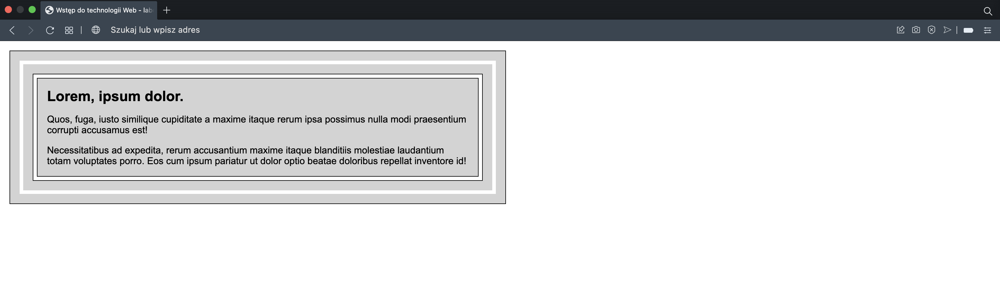
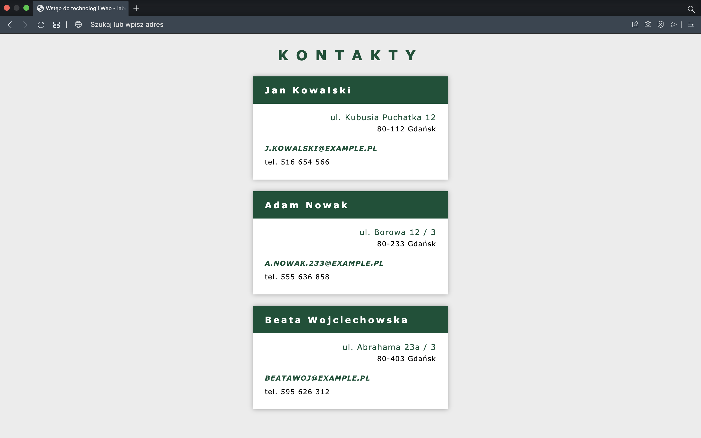
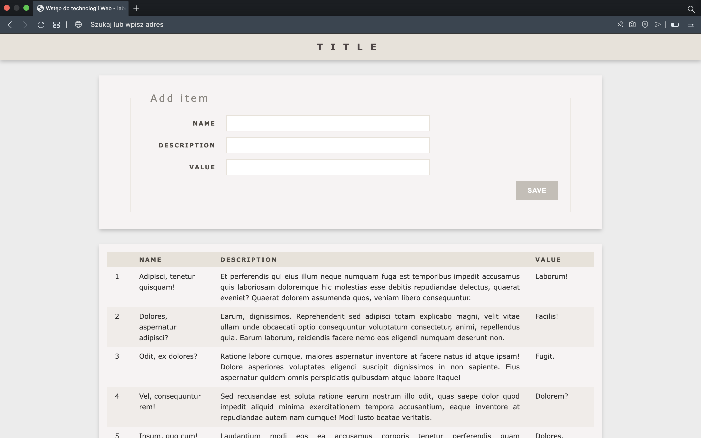
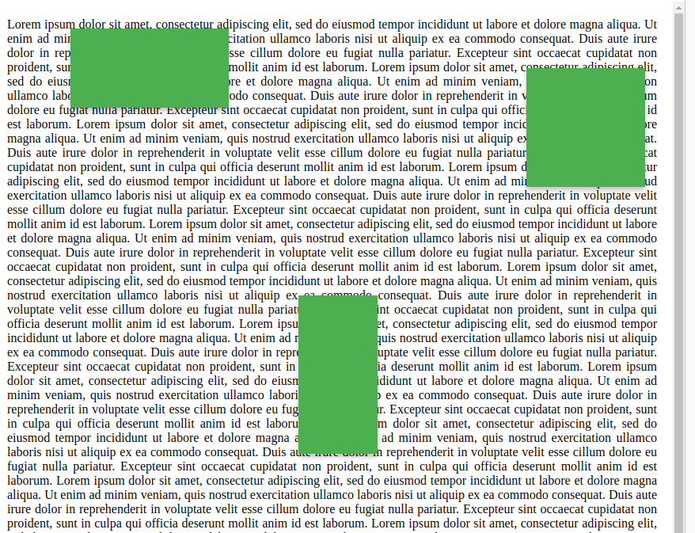

## Laboratorium 3 - Wprowadzenie do kaskadowych arkuszy stylów - CSS
**Zadanie 1** (X pkt)

Korzystając z języka znaczników HTML oraz kaskadowych arkuszy stylów CSS utwórz dokument, który w kontekście pozwala uzyskać efekt zaprezentowany poniżej:

**Zadanie 2** (X pkt)

Korzystając z języka znaczników HTML oraz kaskadowych arkuszy stylów CSS utwórz dokument, który w kontekście pozwala uzyskać efekt zaprezentowany poniżej:

**Zadanie 3** (X pkt)

Korzystając z języka znaczników HTML oraz kaskadowych arkuszy stylów CSS utwórz dokument, który w kontekście pozwala uzyskać efekt zaprezentowany poniżej:

**Zadanie 4** (X pkt)

Korzystając z języka znaczników HTML oraz kaskadowych arkuszy stylów CSS utwórz dokument, który w kontekście pozwala uzyskać efekt zaprezentowany poniżej:

Podczas przewijania strony, jeden z zielonych elementów ma się również przesuwać. Pozostałe mają pozostać na swoich miejscach.

**Zadanie 5** (X pkt)

Korzystając z języka znaczników HTML oraz kaskadowych arkuszy stylów CSS utwórz dokument, który w kontekście pozwala uzyskać efekt zaprezentowany poniżej:

