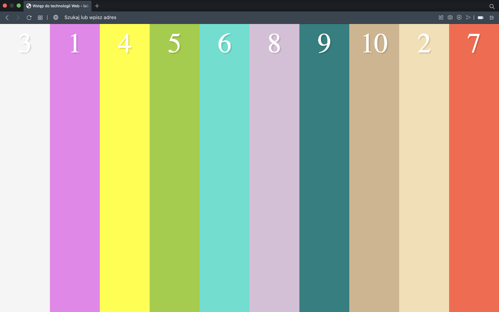
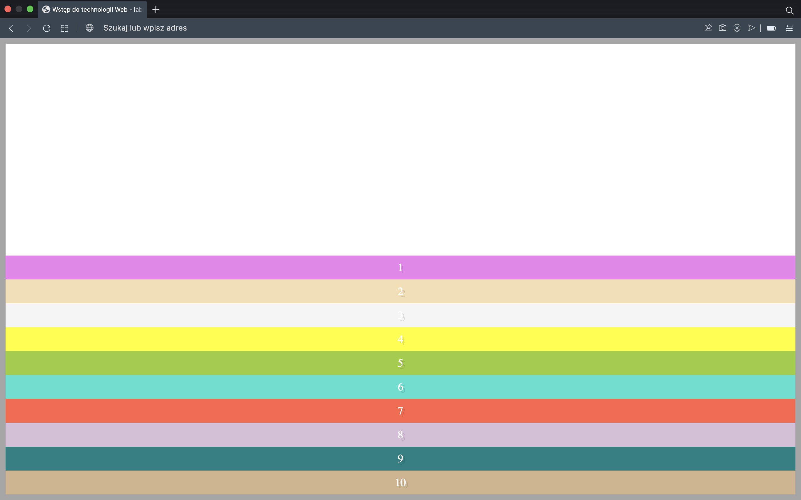
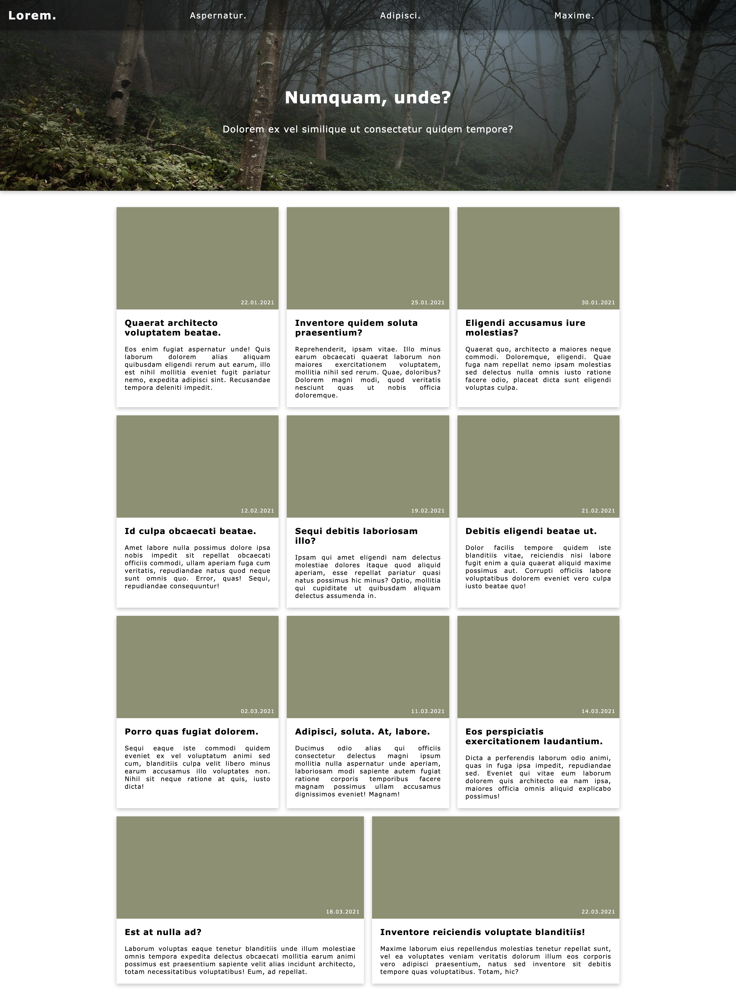
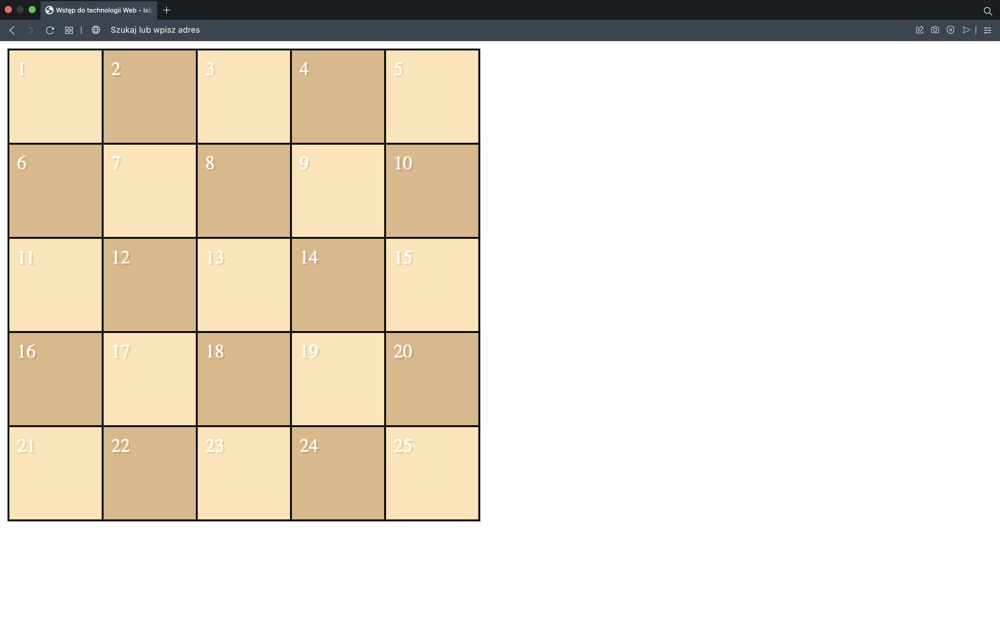
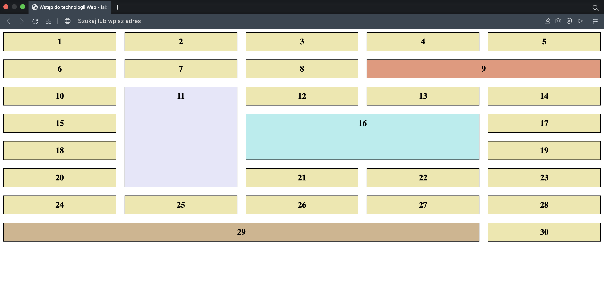
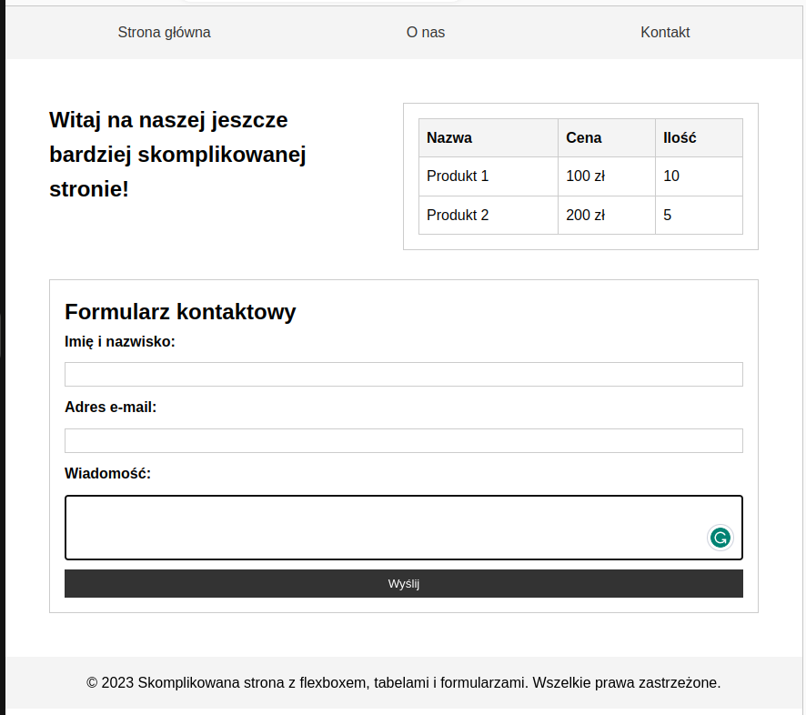

## Laboratorium 5 - Tworzenie zaawansowanych układów: Flexbox oraz CSS Grid
**Zadanie 1** (X pkt)

Korzystając z języka znaczników HTML oraz kaskadowych arkuszy stylów CSS utwórz dokument, który w kontekście pozwala uzyskać efekt zaprezentowany poniżej:

**Uwaga**: Elementy mają być ustawione w kolejności od 1 do 10 i ustawione za pomocą właściwości order.

**Zadanie 2** (X pkt)

Korzystając z języka znaczników HTML oraz kaskadowych arkuszy stylów CSS utwórz dokument, który w kontekście pozwala uzyskać efekt zaprezentowany poniżej:

**Uwaga**: Pierwsza połowa (białe tło) jest na 50% całej wysokości strony - nie należy ją ustawiać ręcznie!!!

**Zadanie 3** (X pkt)

Korzystając z języka znaczników HTML oraz kaskadowych arkuszy stylów CSS utwórz dokument, który w kontekście pozwala uzyskać efekt zaprezentowany poniżej:

Zwróć uwagę na ostatni wiersz układu

**Zadanie 4** (X pkt)

Korzystając z języka znaczników HTML oraz kaskadowych arkuszy stylów CSS utwórz dokument, który w kontekście pozwala uzyskać efekt zaprezentowany poniżej:

**Zadanie 5** (X pkt)

Korzystając z języka znaczników HTML oraz kaskadowych arkuszy stylów CSS utwórz dokument, który w kontekście pozwala uzyskać efekt zaprezentowany poniżej:

**Zadanie 6** (X pkt)

Korzystając z języka znaczników HTML oraz kaskadowych arkuszy stylów CSS utwórz dokument, który w kontekście pozwala uzyskać efekt zaprezentowany poniżej:

