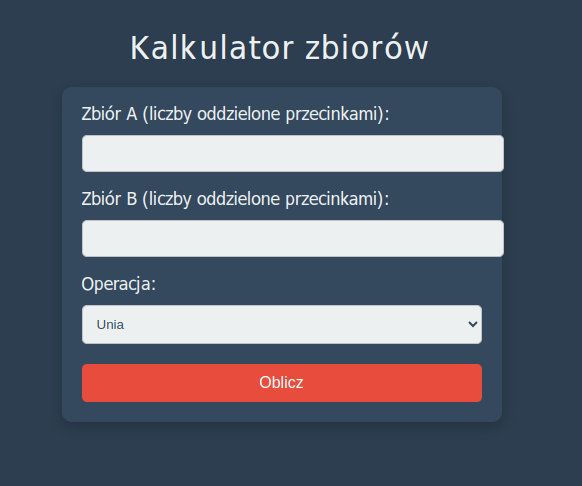
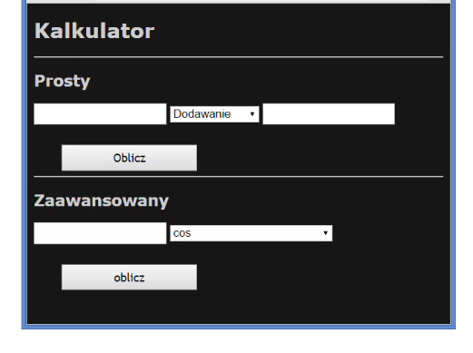
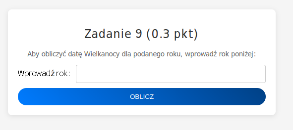
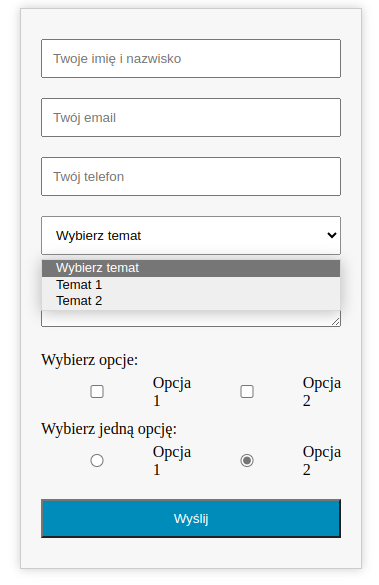

## Laboratorium 7 - Tablice oraz formularze
**Zadanie 1** (X pkt)

Napisz skrypt w języku PHP, który pobierze od użytkownika tablicę liczb, a następnie pozycję n z tej tablicy.

Wynikiem działania programu ma być tablica, gdzie na n-tej pozycji znajdzie się znak $. Tablica ma być "rozepchnięta".

W przypadku błędnego parametru n, program ma wyświetlić komunikat BŁĄD.

Sample Input 1:

1 2 3 4 5
3

Sample Output 1:

1 2 3 $ 4 5

Sample Input 2:

1 2 3 4 5
-3

Sample Output 2:

BŁĄD

**Zadanie 2** (X pkt)

Napisz skrypt w języku PHP, który pobierze liczby w postaci ósemkowej (podane przez użytkownika), a następnie wypisze ich odpowiednie wartości w postaci szesnastkowej.

Wskazówka: Należy skorzystać z funkcji octdec oraz dechex.

Sample Input 1:

717 233

Sample Output 1:

0x1cf 0x9b

**Zadanie 3** (X pkt)

Utwórz plik file.php w którym umieścisz stronę HTML z wyświetlonym twoim imieniem i nazwiskiem.

Następnie plik ten umieść na serwerze szuflandia (http://szuflandia.pjwstk.edu.pl).

Sprawdź, czy strona działa pod adresem: http://szuflandia.pjwstk.edu.pl/~numer_indeksu

Jako odpowiedź prześlij link do strony na serwerze szuflandia.

**Zadanie 4** (X pkt)

Stwórz stronę internetową z kalkulatorem zbiorów, która będzie umożliwiała użytkownikowi wprowadzenie dwóch zestawów liczbowych oraz wybór operacji do wykonania na tych zbiorach. Strona powinna być napisana z wykorzystaniem PHP, HTML oraz CSS. Jej wygląd powinien wyglądać następująco:

Rozwiązanie umieść na serwerze szuflandia.

**Zadanie 4** (X pkt)

Napisz skrypt realizujący kalkulator prosty i kalkulator zaawansowany. Kalkulator prosty ma
obliczać następujące działania:

- Dodawanie
- Odejmowanie
- Mnożenie
- Dzielenie

Kalkulator zaawansowany ma obliczać następujące działania:

- Cosinus
- Sinus
- Tangens
- Binarne na dziesiętne
- Dziesiętne na binarne
- Dziesiętne na szesnastkowe
- Szesnastkowe na dziesiętne

Pola powinny przechodzić walidację. Program może wyglądać następująco.

**Zadanie 6** (X pkt)

Aby obliczyć datę Wielkanocy dla podanego roku, należy zastosować poniższy algorytm.

        Jeżeli podany rok mieści się w granicach od 1 do 1582, to x = 15, y = 6;
        Jeżeli podany rok mieści się w granicach od 1583 do 1699, to x = 22, y = 2;
        Jeżeli podany rok mieści się w granicach od 1700 do 1799, to x = 23, y = 3;
        Jeżeli podany rok mieści się w granicach od 1800 do 1899, to x = 23, y = 4;
        Jeżeli podany rok mieści się w granicach od 1900 do 2099, to x = 24, y = 5;
        Jeżeli podany rok mieści się w granicach od 2100 do 2199, to x = 24, y = 6;
        W przeciwnym wypadku, wyświetl „Nieprawidłowy rok” i zakończ procedurę.

        a = reszta z dzielenia roku r przez 19;
        b = reszta z dzielenia roku r przez 4;
        c = reszta z dzielenia roku r przez 7;
        d = reszta z dzielenia (19 * a + x) przez 30;
        e = reszta z dzielenia (2 * b + 4 * c + 6 * d + y) przez 7;

        Jeżeli e = 6 i d = 29, to Wielkanoc przypada 26 kwietnia;
        Jeżeli e = 6 i d = 28 i ((11 * x + 11) mod 30 < 19), to Wielkanoc przypada 18 kwietnia;
        Jeżeli (d + e) < 10, to Wielkanoc = (22 + d + e) marca;
        Jeżeli (d + e) > 9, to Wielkanoc = (d + e - 9) kwietnia;

Twoim zadaniem jest stworzenie formularza, który umożliwi użytkownikowi wprowadzenie roku, a następnie, po przesłaniu formularza, wyświetli obliczoną datę Wielkanocy. Formularz ten powinien być stylizowany za pomocą CSS, w celu zapewnienia czytelności i atrakcyjności wizualnej.

Napisz skrypt obliczający datę Wielkanocy dla podanego roku i upewnij się, że strona przechodzi walidację. Poniżej znajduje się przykład, jak może wyglądać gotowy formularz:

**Zadanie 6** (X pkt)

Stwórz formularz kontaktowy, zawierający pola: imię i nazwisko, email, telefon, temat do wyboru z listy, treść wiadomości, grupę checkboxów z pytaniem i dwoma opcjami oraz grupę radiobuttonów z pytaniem i dwoma opcjami. Wszystkie pola muszą być walidowane po stronie serwera. Formularz powinien być estetycznie ostylowany przy użyciu CSS (patrz rysunek poniżej), a po przesłaniu danych, wszystkie wprowadzone informacje mają być wyświetlane w postaci nieuporządkowanej listy.

Pola mają mieć walidację po stronie serwera (wszystkie pola powinny być wymagane, a w przypadku telefonu kontaktowego oraz adresu email powinno być wyrażone odpowiednim wyrażeniem regularnym).

Rozwiązanie należy umieścić na zewnętrznym serwerze, a jako odpowiedź przesłać link do strony oraz kod pliku .php.