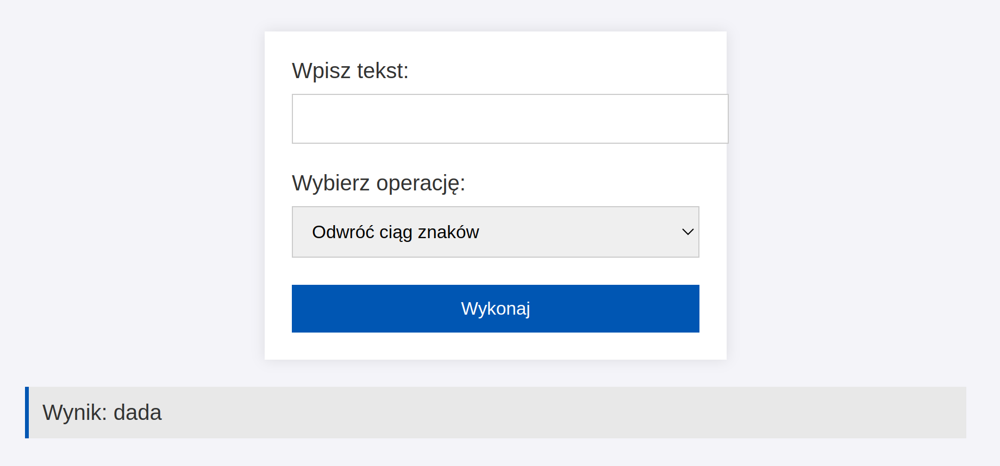
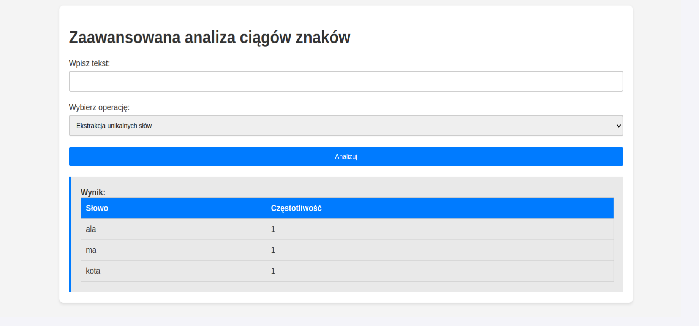
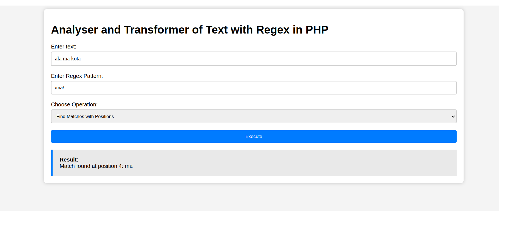

## Laboratorium 8 - Operacje na ciągach znaków oraz wyrażenia regularne
**Zadanie 1** (X pkt)

Stwórz aplikację webową, która pozwoli użytkownikowi na wykonanie różnych operacji na ciągach znaków. Aplikacja powinna być napisana w PHP i stylizowana przy użyciu CSS.

- Interfejs użytkownika:

  - Prosty formularz z polem tekstowym, w którym użytkownik może wprowadzić dowolny ciąg znaków.
    -  Lista rozwijana (dropdown) zawierająca różne operacje do wyboru na ciągach znaków, takie jak:
        - Odwrócenie ciągu znaków.
        - Zamiana wszystkich liter na wielkie.
        - Zamiana wszystkich liter na małe.
        - Liczenie liczby znaków.
        - Usuwanie białych znaków z początku i końca ciągu.
    - Przycisk „Wykonaj”, który przetwarza wprowadzone dane i wykonuje wybraną operację.
- Logika backendowa:
     - Obsługa formularza i wykonywanie operacji na ciągach znaków za pomocą wbudowanych funkcji PHP takich jak strrev(), strtoupper(), strtolower(), strlen() i trim(). 
- Wyświetlanie wyników:
      Wyniki powinny być wyświetlane na tej samej stronie poniżej formularza.
      Odpowiednie wiadomości błędów, gdy dane wejściowe są puste lub nieprawidłowe.

Podglądowy wynik strony (zwróć uwagę na stylizację)
     

Rozwiązanie umieść na serwerze szuflandia.

**Zadanie 2** (X pkt)

Stwórz aplikację webową, która umożliwia zaawansowaną analizę i transformację ciągów znaków. Aplikacja powinna wykorzystywać bardziej złożone techniki programowania w PHP, takie jak ekstracja słów oraz algorytmy sortowania.

- Interfejs użytkownika:
    - Formularz z polem tekstowym dla użytkownika do wprowadzenia ciągu znaków.
    - Lista rozwijana z opcjami zaawansowanych operacji tekstowych, w tym:
    - Ekstrakcja unikalnych słów i ich częstotliwość występowania.
    - Sortowanie alfabetyczne słów w ciągu z opcją rosnąco i malejąco.
    - Dodatkowe pola i opcje, które umożliwią użytkownikowi dostosowanie wykonania operacji (np. wybór sposobu sortowania).
- Logika backendowa:
    - Implementacja zaawansowanych funkcji PHP do manipulacji i analizy ciągów znaków.
    - Zastosowanie funkcji sortowania w PHP, możliwe zaimplementowanie własnego algorytmu sortującego dla specjalnych przypadków (implementacja za dodatkowe punkty).
- Wyświetlanie wyników:
    - Wyniki operacji powinny być wyświetlane na tej samej stronie poniżej formularza.
    - Implementacja czytelnych i informatywnych wyników, które będą mogły zawierać tabele, listy czy wykresy (w zależności od rodzaju operacji).

Podglądowy wynik strony (zwróć uwagę na stylizację)

**Zadanie 3** (X pkt)

Stwórz aplikację webową, która umożliwi zaawansowaną analizę i przetwarzanie tekstu za pomocą wyrażeń regularnych w PHP. Aplikacja powinna umożliwiać użytkownikom przeszukiwanie, ekstrakcję, zamianę i walidację tekstu na podstawie różnych wzorców regex.

- Interfejs użytkownika:
  - Formularz z polem tekstowym, w którym użytkownik może wprowadzić tekst do analizy.
  - Drugie pole tekstowe do wprowadzenia wzorca regex.
  - Lista rozwijana zawierająca operacje do wyboru, które można wykonać przy użyciu wyrażeń regularnych:
    - Znajdowanie wszystkich wystąpień wzorca (Match).
    - Znajdowanie i wyświetlanie pozycji wystąpień wzorca (Match Positions).
    - Zamiana wyrażeń pasujących do wzorca na inny ciąg znaków (Replace).
    - Sprawdzanie, czy tekst pasuje do wzorca (Validate).
    - Pole tekstowe do wprowadzenia ciągu zamiany (wyświetlane tylko gdy wybrana jest opcja zamiany).
  - Przycisk „Wykonaj”, który przetwarza dane i wykonuje wybraną operację.
- Logika backendowa:
  - Obsługa formularza i wykonanie odpowiednich operacji na ciągach znaków z wykorzystaniem wyrażeń regularnych.
  - Użycie funkcji preg_match_all(), preg_replace(), i preg_match() do obsługi różnych operacji regex.
- Wyświetlanie wyników:
  - Wyniki operacji powinny być wyświetlane na tej samej stronie poniżej formularza.
  - W przypadku operacji zamiany, wyświetl zmieniony tekst.
  - W przypadku operacji matchowania, wyświetl wszystkie znalezione wystąpienia oraz ich pozycje.

Podglądowy wynik strony (zwróć uwagę na stylizację)

