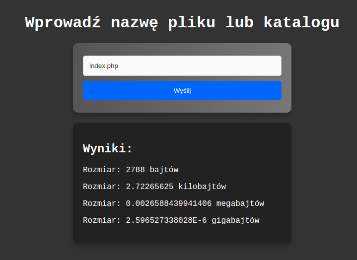
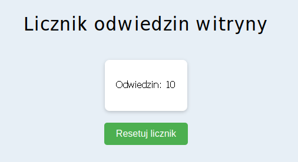
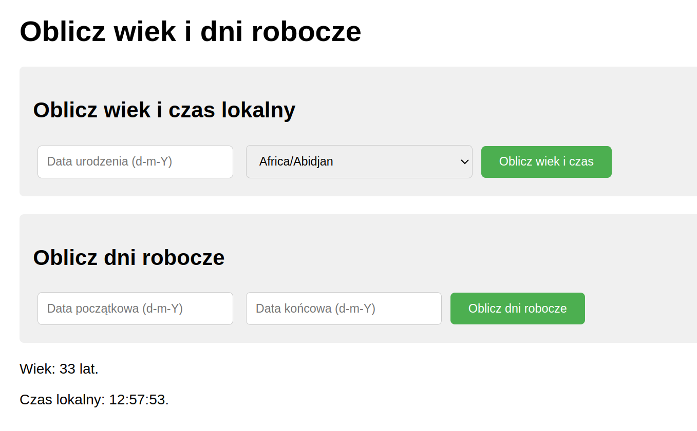
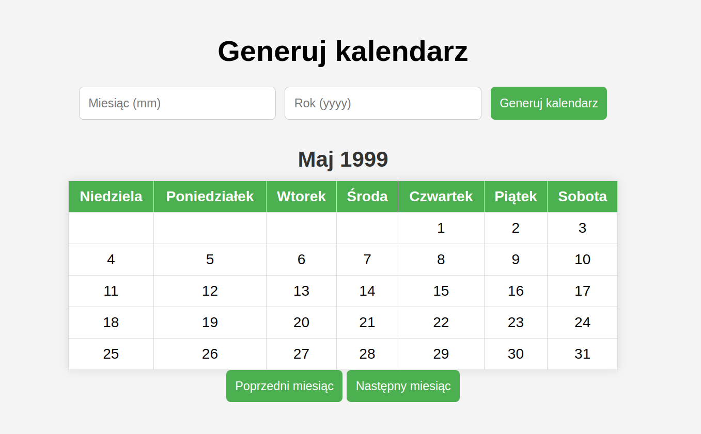
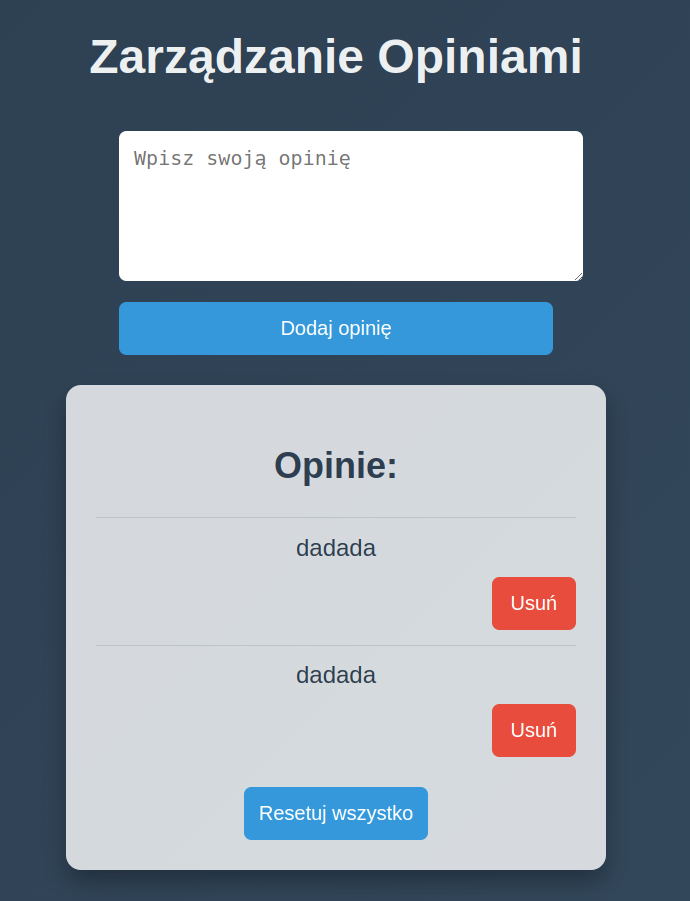

## Laboratorium 9 - Operacje datach oraz plikach i katalogach
**Zadanie 1** (X pkt)

Utwórz stronę internetową, która będzie zawierać formularz do wprowadzania nazwy pliku lub katalogu. Po przesłaniu formularza strona ma wyświetlić rozmiar danego pliku lub sumę rozmiarów plików w katalogu w bajtach, megabajtach oraz gigabajtach. W przypadku braku pliku lub katalogu, powinien zostać wyświetlony komunikat o braku.

Wytyczne:

- Formularz składający się z pola do wprowadzenia tekstu oraz przycisku "Wyślij".
- Skrypt PHP analizujący rozmiar pliku lub katalogu na serwerze.
- Wyświetlanie informacji o rozmiarze lub komunikatu o błędzie.

Podglądowy wynik strony (zwróć uwagę na stylizację)
     

Rozwiązanie umieść na serwerze szuflandia.

**Zadanie 2** (X pkt)

Stwórz stronę internetową, która będzie zapisywać i wyświetlać liczbę odwiedzin. Licznik odwiedzin ma być przechowywany w pliku tekstowym licznik.txt. Strona powinna także oferować funkcjonalność resetowania licznika za pomocą przycisku.

Wytyczne:

- Każde odświeżenie strony powinno zwiększać licznik odwiedzin zapisany w pliku licznik.txt.
- Przycisk resetowania licznika powinien umożliwić jego zerowanie.

Podglądowy wynik strony (zwróć uwagę na stylizację)

**Zadanie 3** (X pkt)

Stwórz stronę internetową, która będzie zawierała dwa formularze:

- Formularz obliczania wieku i czasu lokalnego:

    - Przyjmuje datę urodzenia użytkownika w formacie "d-m-Y" i strefę czasową (np. "Europe/Warsaw").
    - Po wysłaniu formularza, strona oblicza wiek użytkownika oraz wyświetla aktualny czas lokalny dla podanej strefy czasowej.
- Formularz obliczania dni roboczych:

    - Przyjmuje dwie daty w formacie "d-m-Y".
    - Oblicza, ile dni roboczych (od poniedziałku do piątku) znajduje się między tymi datami.

Podglądowy wynik strony (zwróć uwagę na stylizację)

**Zadanie 4** (X pkt)

Stwórz stronę internetową, która umożliwi generowanie kalendarza z przyciskami do nawigacji (poprzedni/następny miesiąc) oraz dodawanie i wyświetlanie wydarzeń w wybranych dniach.

Zadanie obejmuje:

- Formularz przyjmujący miesiąc i rok do wygenerowania kalendarza.
- Funkcjonalność przeglądania kolejnych i poprzednich miesięcy.

**Zadanie 5** (X pkt)

Stworzyć stronę internetową z formularzem do zbierania opinii użytkowników. Strona powinna umożliwiać nie tylko dodawanie nowych opinii, ale także wyświetlanie wszystkich zapisanych opinii, ich edycję oraz usuwanie. Opinie powinny być zapisywane w pliku tekstowym.

Funkcjonalności:

- Formularz do wprowadzania i wysyłania nowych opinii.
- Wyświetlanie listy wszystkich zapisanych opinii.
- Możliwość usuwania każdej z opinii.
- Przycisk do resetowania wszystkich opinii (czyszczenie pliku).

