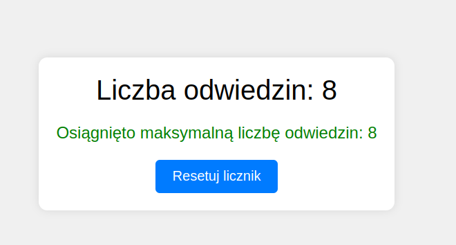
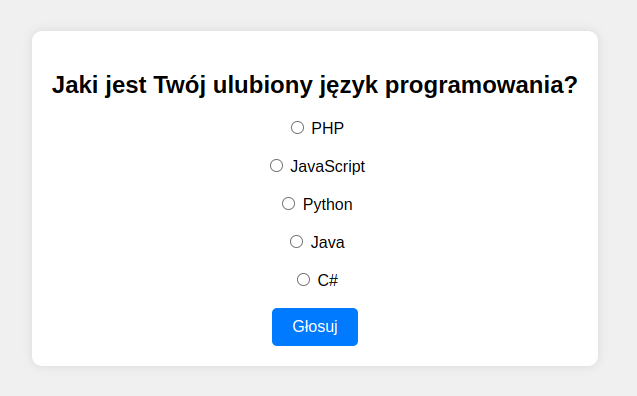
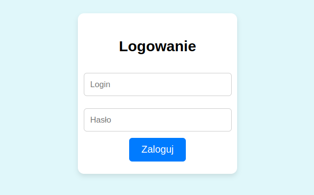
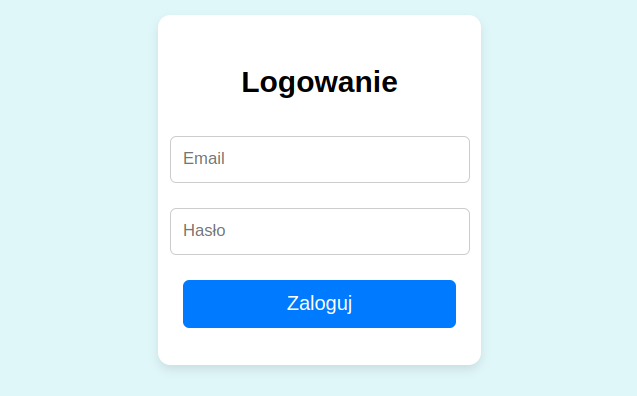
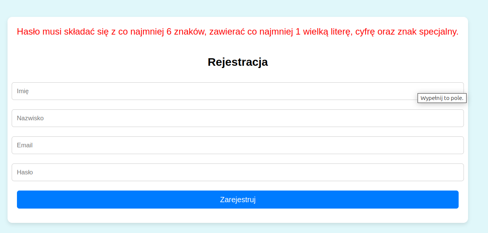
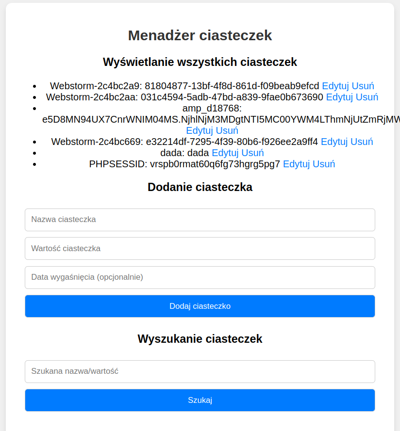

## Laboratorium 10 - Sesje oraz ciasteczka w PHP
**Zadanie 1** (X pkt)

Utwórz aplikację webową, która za pomocą cookies zlicza liczbę odwiedzin strony przez danego użytkownika. Po osiągnięciu zadanej wartości wyświetla stosowną informację. Na tej samej stronie powinien znajdować się przycisk do resetowania licznika odwiedzin.

Strona powinna zawierać:
- Informację o liczbie odwiedzin.
- Komunikat wyświetlany po osiągnięciu określonej liczby odwiedzin.
- Przycisk do resetowania licznika odwiedzin.

Podglądowy wynik strony (zwróć uwagę na stylizację)
     

Rozwiązanie umieść na serwerze szuflandia.

**Zadanie 2** (X pkt)

Stwórz aplikację webową w, która realizuje sondę internetową z wykorzystaniem cookies. Aplikacja powinna zawierać formularz do głosowania z pytaniem i odpowiedziami do wyboru. Skrypt sprawdzi, czy użytkownik już głosował (na podstawie ciasteczka) i wyświetli stosowną informację. Przy pierwszym głosowaniu skrypt zapisze ciasteczko, uniemożliwiając ponowne przesłanie formularza.

Przykładowy wygląd strony:

**Zadanie 3** (X pkt)

Stwórz formularz logowania z wykorzystaniem $_SESSION. Formularz powinien zawierać pole na login i hasło. Skrypt sprawdzi poprawność loginu i hasła (mogą być zapisane w kodzie jako zmienne). Jeśli login i hasło są poprawne, wyświetl informację o poprawnym zalogowaniu oraz link „wyloguj”, który wyloguje użytkownika i powróci do formularza. Jeśli login lub hasło są błędne, wyświetl informację o błędnym logowaniu oraz link do powrotu do formularza.

Uwaga: W przypadku działania serwera XAMPP należy w pliku php.ini odnaleźć linię session.save_path = "\xampp\tmp" i podmienić na session.save_path = "D:\xampp\tmp". Inaczej XAMPP nie będzie poprawnie zapisywał sesji do katalogu tymczasowego.

Przykładowy wygląd strony:

**Zadanie 4** (X pkt)

1. Utwórz formularz rejestracyjny zawierający pola: imię, nazwisko, email oraz hasło. Hasło powinno składać się z co najmniej 6 znaków, zawierać co najmniej 1 wielką literę, cyfrę oraz znak specjalny. Po przesłaniu formularza dane powinny być zachowane w pliku tekstowym.
2. Stwórz formularz logowania korzystający z zachowanych w pliku tekstowym danych. Formularz logowania powinien sprawdzać poprawność danych i umożliwiać logowanie oraz wylogowanie użytkownika. Należy również zadbać o unikalność adresów email podczas rejestracji.

Przykładowe wyglądy strony:

**Zadanie 5** (X pkt)

Napisz aplikację webową, która będzie "menadżerem ciasteczek". Strona powinna realizować następujące funkcjonalności:

- Wyświetlanie wszystkich ciasteczek 
- Dodanie ciasteczka (podanie jego nazwy, wartości oraz opcjonalnie daty wygaśnięcia)
- Edytowanie ciasteczka (w nowym oknie) 
- Usunięcie ciasteczka (z potwierdzeniem usunięcia na osobnej stronie) 
- Wyszukanie ciasteczek po nazwie/wartości  (czyszczenie pliku).

