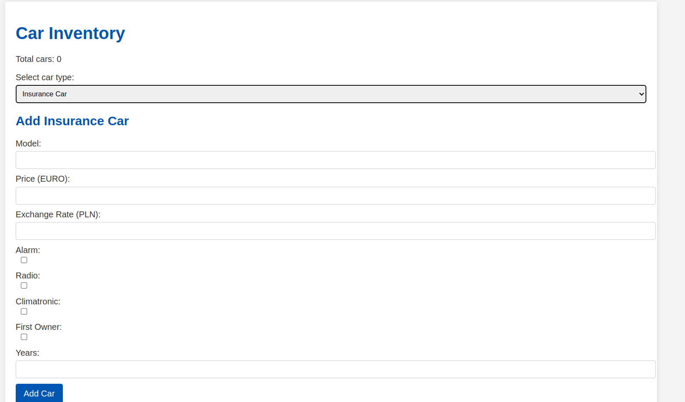
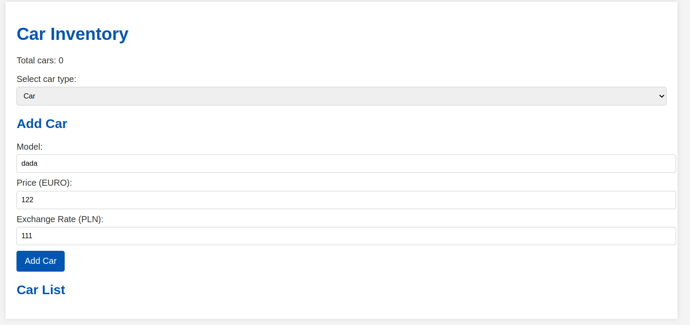

## Laboratorium 11 - Obiektowy PHP
**Zadanie 1** (X pkt)

Napisz klasę o nazwie MyClass, która po utworzeniu obiektu wyświetli na ekranie ciąg znaków: Obiekt klasy MyClass został utworzony.


**Zadanie 2** (X pkt)

Napisz klasę o nazwie User, która będzie miała następujące właściwości:

- Będzie posiadała atrybut $message z domyślnie ustawioną wartością "This is a message from";
- Będzie posiadała metodę introduce($name), która będzie zwracała ciąg tekstowy "This is a message from $name", gdzie podajemy oczywiście wartość parametru $name.

**Zadanie 3** (X pkt)

Zdefiniuj klasę Car, która będzie miała następujące cechy:

- Będzie zawierała statyczną zmienną $count, określającą ilość utworzonych samochodów (czyli tworzonych obiektów za pomocą operatora new);
- Będzie zawierała prywatne właściwości $model, $price (w EURO) oraz $exchangeRate w złotówkach;
- Będzie zawierała metody get oraz set dla wszystkich wyżej wymienionych zmiennych;
- Będzie zawierała metodę value, która zwracać będzie cenę samochodu w złotówkach.

Następnie zdefiniuj klasę NewCar, która będzie dziedziczyć po klasie Car oraz:

- Będzie posiadać prywatne pola $alarm, $radio, $climatronic, każde przyjmujące wartości true/false;
- Będzie posiadała metody get oraz set dla wyżej wymienionych zmiennych;
- Będzie posiadała konstruktor przyjmujący wszystkie argumenty (zarówno z Car, jak i z NewCar);
- Będzie posiadała przesłoniętą metodę value, która:

W przypadku $alarm == true zwiększy cenę o 5%;
W przypadku $radio == true zwiększy cenę o 7,5%;
W przypadku $climatronic == true zwiększy cenę o 10%.
Każda z wyżej wymienionych klas powinna również posiadać nadpisaną metodę __toString(), która będzie zwracać w postaci ciągu tekstowego wartości wszystkich parametrów klasy.

Przykłady wywołań metody `__toString()`:

```
Model: Model S, Price: 50000 EURO, Exchange Rate: 4.5 PL
Model: Model X, Price: 60000 EURO, Exchange Rate: 4.5 PLN, Alarm: Yes, Radio: Yes, Climatronic: Yes
```

**Zadanie 4** (X pkt)

Zdefiniuj klasę InsuranceCar, która będzie dziedziczyć po klasie NewCar (z zadania poprzedniego) i będzie posiadać następujące cechy:

- Będzie posiadać prywatne parametry $firstOwner oraz $years.
- Będzie posiadać metody get oraz set dla wyżej wymienionych zmiennych.
- Będzie posiadać konstruktor, który przyjmuje wszystkie parametry.
- Będzie miała przesłoniętą metodę value, która od ceny odejmie 1% pomnożony przez wartość $years oraz 5% od ceny, jeżeli $firstOwner == true.
- Klasę NewCar oraz Car z poprzedniego zadania wklej tutaj.

**Zadanie 5** (X pkt)

Utwórz stronę internetową z formularzem, która będzie posiadać:

- Wyświetloną wartość występujących na stronie ilości samochodów.
- Opcję wyboru za pomocą listy lub przycisku stworzenia obiektu Car, NewCar lub InsuranceCar.
- Formularz w zależności od wyboru, umożliwiający wprowadzenie danych do konstruktora.
- Po wysłaniu formularza powinna pojawić się na stronie lista z utworzonymi obiektami, umożliwiająca:
  - Obliczenie ceny (po naciśnięciu odpowiedniego przycisku).
  - Wyświetlenie szczegółowych danych (na osobnej stronie).
  - Edycję danych samochodu.
  - Usunięcie samochodu z listy.
Przykładowe wyglądy strony:

[](assets/img.png)

[](assets/img_1.png)