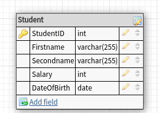
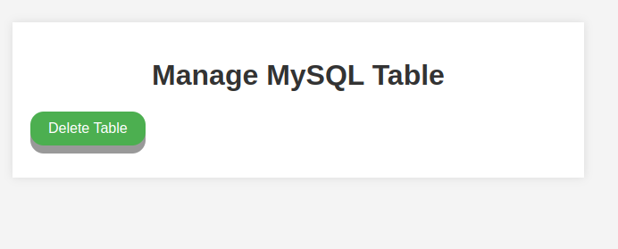
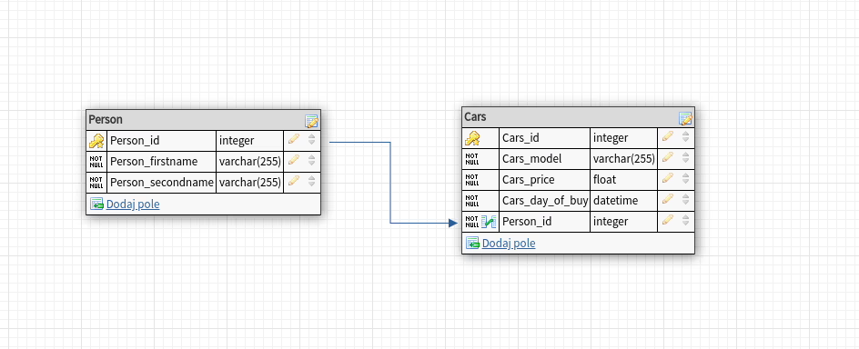
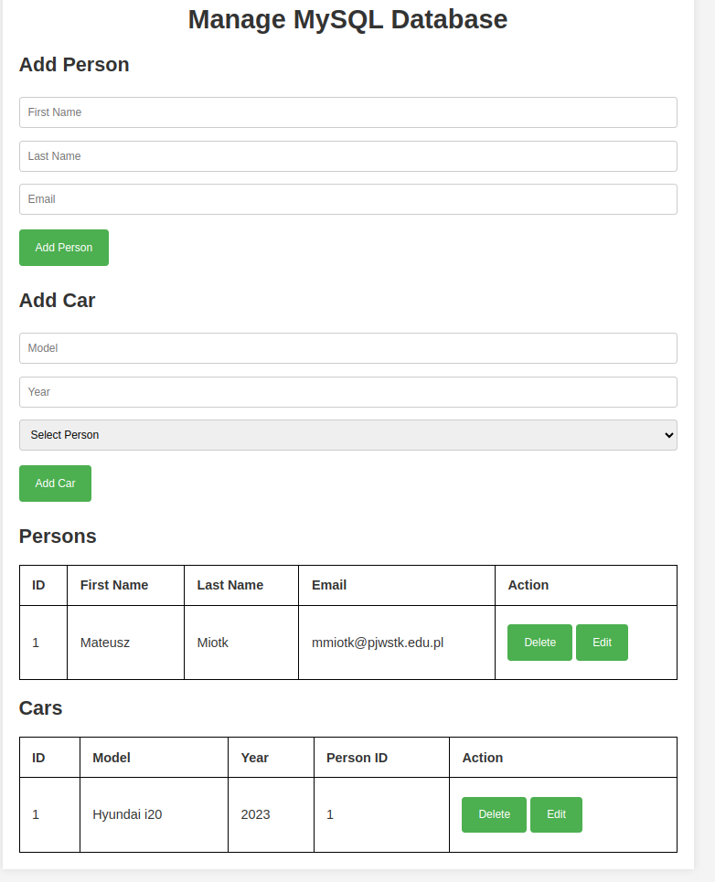
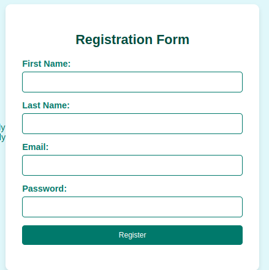
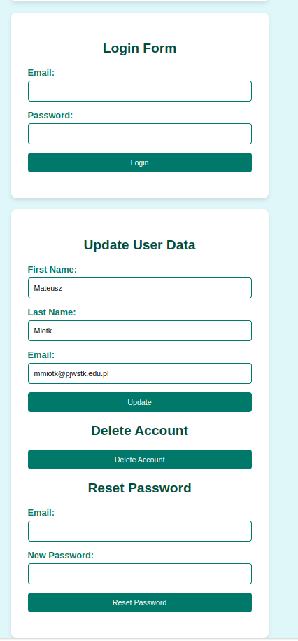

## Laboratorium 12 - Programowanie baz danych w PHP
**Zadanie 1** (X pkt)

Za pomocą skryptu PHP oraz mysqli utwórz następującą tabelę w bazie danych mysql na serwerze szuflandia:

[](assets/img_2.png)

Strona powinna wyświetlić komunikat o utworzeniu tabeli oraz powinna obsłużyć wyjątek, kiedy tabela będzie już utworzona.

Strona powinna posiadać przycisk kasowania tabeli, dzięki któremu usunie się ona z bazy a po jej odświeżeniu utworzy się ponownie.

Przykładowy widok strony:

[](assets/img_3.png)

**Zadanie 2** (X pkt)

Na komputerze lokalnym dokonaj podłączenia się z bazą MySQL za pomocą PDO.

Za pomocą skryptu w PHP utwórz następujące tabele w bazie danych:

[](assets/img_4.png)

Strona powinna wyświetlić komunikat o utworzeniu tabeli oraz powinna obsłużyć wyjątek, kiedy tabela będzie już utworzona. Strona powinna posiadać również następujące funkcjonalności:

- Formularz dodania obiektu klasy Person oraz Cars. W Cars pole Person_id powinno być wybieralne z listy
- Możliwość wyświetlenia wszystkich danych z obydwu tabel
- Każdy rekord danych powinien posiadać przycisk edycji danych (w wyświetlonych danych). Po naciśnięciu tego przycisku powinien pokazać się formularz z uzupełnionymi danymi, na których chcemy dokonać zmiany
- Każdy rekord danych powinien posiadać przycisk usunięcia danych. Po naciśnięciu przycisku powinien się wyświetlić komunikat potwierdzający.
- Możliwość sortowania wyników tabeli wedle określonego pola
- Możliwość wyszukiwania wyników tabeli wedle określonego pola

Przykładowy wygląd strony:

[](assets/img_5.png)

**Zadanie 3** (X pkt)

Aby zabezpieczyć hasła użytkowników w bazie danych w języku PHP, możemy do tego użyć funkcji password_hash:

```php
$password = 'silneHaslo1@';
$hash = password_hash($password, PASSWORD_DEFAULT);
echo $hash;
```
Wynik, który jest zwracany z metody password_hash() jest bezpieczny, ponieważ: wykorzystuje ‎‎silny algorytm szyfrujący (jest to obecnie metodo bcrypt) oraz dodaje ‎‎losową tzw. sól,‎‎ aby zapobiec wyczerpującym atakom i atakom słownikowym.‎ Czyli za każdym razem otrzymamy inny tzw. skrót dla danego hasła. Oto przykłądy wygenerowanych haseł dla powyższego kodu: 

```
$2y$10$G.jBMzXew.PjPE6jNCmmNu6/IUtuUswn00nHn8R7YvVTHjt3ttUfe
$2y$10$vjCSBzawrEASzLRLYLGCnOqQGWoyFSdgtyqjYxiZocKBCnP3s98Ba
$2y$10$Z.re.8meKvlXKmzFp1oHcud0JbyXlmjgYcmqTcEtWhLl7DMZrLc/e
```

Aby zweryfikować hasło utworzone za pomocą password_hash() podane przez użytkownika, należy użyć funkcji ‎‎password_verify().‎ Funkcja ta przyjmuje dwa argumenty:‎ ‎hasło, które powinno być zweryfikowane na poziomie formularza, jako pierwszy argument‎ oraz ‎skrót z funkcji ‎‎password_hash()‎‎ oryginalnego hasła. ‎Jeśli hasło jest poprawne, ‎‎funkcja password_verify()‎‎ zwraca wartość ‎‎true‎‎.‎

```php
$password = 'silneHaslo1@'; // Pobieramy te dane z formularza; wcześniej sprawdzamy poprawną formę
$hash = password_hash($password, PASSWORD_DEFAULT); // $hash pobieramy z bazy danych
var_dump(password_verify($password, $hash));
```

Napisz stronę w PHP, który będzie zawierał formularz rejestracyjny użytkowników do serwisu. Użytkownicy powinni podać co najmniej 5 różnych danych. Strona powinna wyświetlić ilość zarejestrowanych użytkowników i zapisywać ich do utworzonej dla nich bazy danych.

Hasła powinny być kodowane w bazie (za pomocą funkcji haszujących). 

Przykładowy wygląd strony: 

[](assets/img_6.png)

**Zadanie 4** (X pkt)

Do poprzedniego zadania dopisz formularz logowania się użytkownika do serwisu. Po zalogowaniu użytkownik:

- Może zmienić swoje dane
- Może usunąć konto
- Rozważ sytuację poprawnego logowania (0.1 pkt) oraz niepoprawnego logowania (0.1 pkt). Skorzystaj z sesji albo ciasteczek (0.1 pkt).

- Dodatkowo w przypadku utworzenia mechanizmu resetowania hasła dla użytkownika.

Przykładowy wygląd strony: 

[](assets/img_7.png)